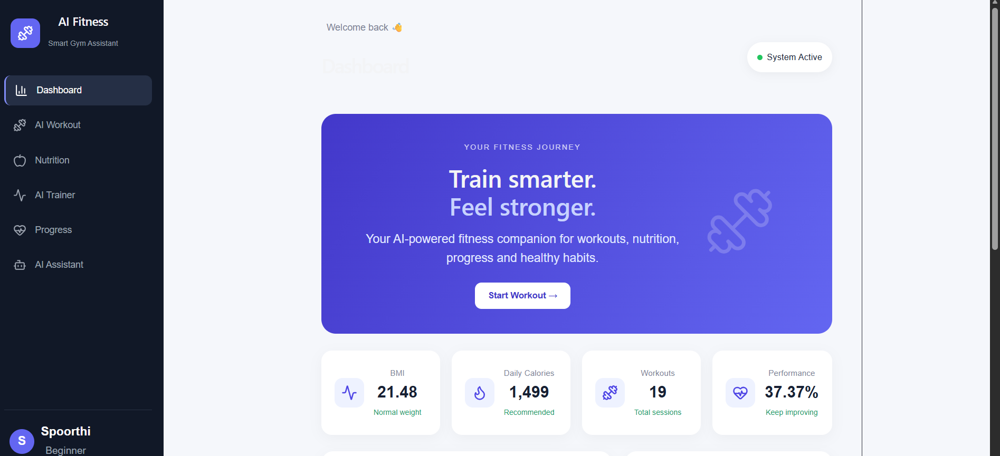
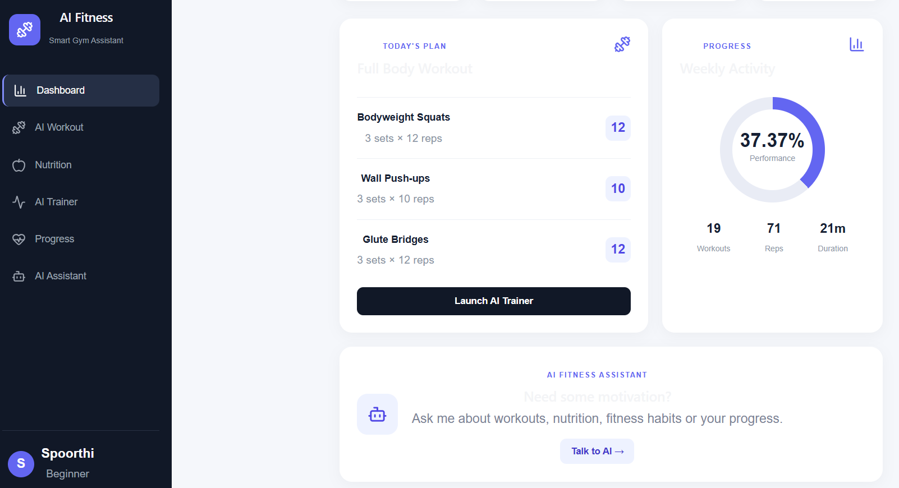

# AI Gym & Fitness Assistant

An AI-powered fitness application that helps users manage workouts, track exercise performance, monitor fitness progress, and receive personalized fitness recommendations through a modern web interface.

## Overview

The AI Gym & Fitness Assistant combines a Python FastAPI backend with a React-based frontend to provide a centralized fitness experience.

The application supports user fitness profiling, BMI calculation, workout recommendations, exercise tracking, nutrition recommendations, habit and mood tracking, progress monitoring, weekly reports, and an AI fitness assistant.

## Key Features

* 👤 **User Fitness Profile**

  * Stores user information such as age, gender, height, weight, fitness goal, and experience level.
  * Generates a fitness profile based on user inputs.

* ⚖️ **BMI Analysis**

  * Calculates Body Mass Index (BMI).
  * Provides a basic BMI category.

* 🏋️ **Workout Recommendations**

  * Generates workout plans based on fitness goals and experience level.
  * Provides exercises with sets and repetitions.

* 🤖 **AI Exercise Trainer**

  * Provides exercise-tracking workflows for supported exercises.
  * Tracks completed repetitions and workout duration.
  * Generates basic workout form feedback.

* 📊 **Progress Tracking**

  * Records workout results.
  * Provides workout history and progress summaries.
  * Displays weekly activity and performance information.

* 🥗 **Nutrition Recommendations**

  * Provides fitness-oriented nutrition recommendations.
  * Displays recommended daily calorie information.

* 💬 **AI Fitness Assistant**

  * Provides an interactive assistant for fitness-related questions.
  * Supports questions related to workouts, nutrition, habits, and progress.

* 📅 **Habit & Mood Tracking**

  * Provides habit summaries.
  * Supports mood analysis workflows.

* 📄 **Weekly Reports**

  * Generates a summary of fitness activity and progress.

## Technology Stack

### Backend

* Python
* FastAPI
* REST APIs
* NumPy
* OpenCV
* TensorFlow / Keras
* SQLite
* Pydantic

### Frontend

* React
* JavaScript
* JSX
* CSS
* Vite

### Development Tools

* Visual Studio Code
* Git
* GitHub
* Postman

## System Architecture

```text
                    ┌──────────────────────────┐
                    │     React Frontend       │
                    │       Vite + JSX         │
                    └────────────┬─────────────┘
                                 │
                                 │ REST API
                                 ▼
                    ┌──────────────────────────┐
                    │     FastAPI Backend      │
                    │        Python            │
                    └────────────┬─────────────┘
                                 │
              ┌──────────────────┼──────────────────┐
              │                  │                  │
              ▼                  ▼                  ▼
        Fitness Services   Workout Services   AI Services
              │                  │                  │
              └──────────────────┼──────────────────┘
                                 │
                                 ▼
                    ┌──────────────────────────┐
                    │        SQLite DB         │
                    │     User & Workout Data  │
                    └──────────────────────────┘
```

## Screenshots

### Dashboard



### Dashboard - Alternate View



## Project Structure

```text
AI-Gym-Fitness-Assistant/
│
├── backend/
│   ├── ai/
│   ├── database/
│   ├── models/
│   ├── routes/
│   ├── services/
│   └── app.py
│
├── frontend/
│
├── react-frontend/
│
├── screenshots/
│   ├── dashboard.png
│   └── dashboard1.png
│
├── .gitignore
└── README.md
```

## Backend API

The FastAPI backend provides REST endpoints for the application's features.

| Feature                  | Endpoint                    |
| ------------------------ | --------------------------- |
| Health Check             | `/health`                   |
| BMI Calculation          | `/fitness/bmi`              |
| User Profile             | `/user/profile`             |
| Workout Recommendation   | `/workout/recommendation`   |
| Exercise Tracking        | `/exercise/start/squat`     |
| Push-up Tracking         | `/exercise/start/pushup`    |
| Workout Results          | `/workout/results`          |
| Progress Summary         | `/progress/summary`         |
| Nutrition Recommendation | `/nutrition/recommendation` |
| AI Chatbot               | `/chatbot/ask`              |
| Weekly Report            | `/report/weekly`            |

Interactive API documentation is available through Swagger UI.

## Running the Project Locally

### 1. Clone the Repository

```bash
git clone https://github.com/Spoo200419/AI-Gym-Fitness-Assistant.git
cd AI-Gym-Fitness-Assistant
```

### 2. Start the Backend

```bash
cd backend
python -m venv venv
```

Activate the virtual environment on Windows:

```powershell
.\venv\Scripts\Activate.ps1
```

Install the backend dependencies using the project's dependency file, if provided:

```bash
pip install -r requirements.txt
```

Start the FastAPI server:

```bash
uvicorn app:app --reload
```

Backend URL:

`http://127.0.0.1:8000`

API Documentation:

`http://127.0.0.1:8000/docs`

### 3. Start the React Frontend

Open another terminal:

```bash
cd react-frontend
npm install
npm run dev
```

Frontend URL:

`http://localhost:5173`

## Example Application Workflow

1. Enter user fitness information.
2. Calculate BMI and view the fitness category.
3. Generate workout recommendations based on fitness goals.
4. Start a supported exercise-tracking session.
5. Record completed repetitions and workout duration.
6. Review workout history and progress information.
7. Explore nutrition recommendations and the fitness assistant.

## Future Enhancements

* Improved exercise pose detection and form analysis.
* More personalized workout and nutrition recommendations.
* Enhanced progress visualization.
* Additional fitness tracking features.
* Improved user experience and responsive design.

## Author

**Spoorthi R**

B.E. Information Science and Engineering | 2026 Graduate

GitHub: https://github.com/Spoo200419

LinkedIn: https://www.linkedin.com/in/spoorthi-r150bb0312
